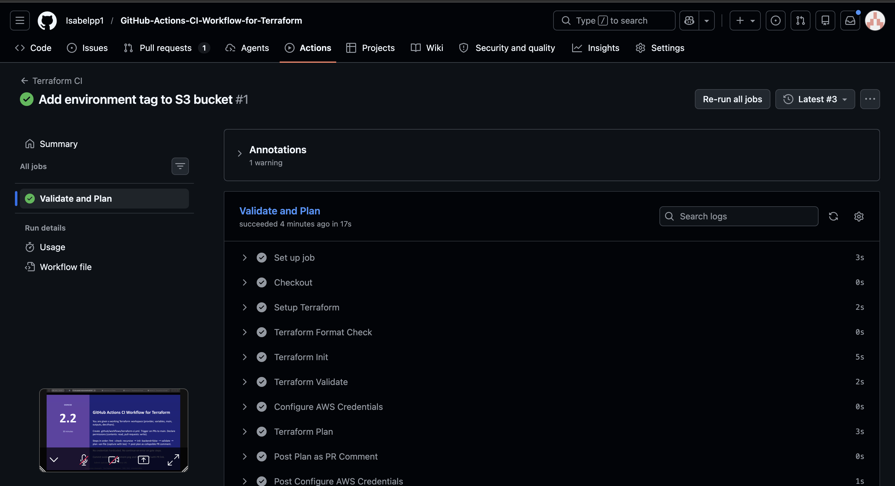

# oyd-exercise-2-2 — Flujo de CI con GitHub Actions para Terraform

Este repositorio contiene un workspace de Terraform que aprovisiona un bucket S3 en AWS, junto con un pipeline de CI en GitHub Actions que valida cada pull request hacia `main` y publica el plan completo de Terraform como comentario colapsable en el PR.

## Descripción del Workflow

El pipeline (`.github/workflows/terraform-ci.yml`) ejecuta los siguientes pasos en cada PR hacia `main`:

1. **fmt** — `terraform fmt --check -recursive` falla el PR si hay errores de formato.
2. **init** — `terraform init -backend=false` (no requiere estado remoto).
3. **validate** — `terraform validate` verifica que la configuración sea válida.
4. **plan** — `terraform plan -var-file=envs/dev/dev.tfvars` captura el output en `plan.txt`.
5. **comentario** — Publica el plan dentro de un bloque colapsable `
` en el PR.

## Secrets requeridos en el repositorio

| Nombre | Descripción |
|---|---|
| `AWS_ACCESS_KEY_ID` | Clave de acceso de AWS |
| `AWS_SECRET_ACCESS_KEY` | Clave secreta de AWS |
| `AWS_REGION` | Región de AWS (ej. `us-east-1`) |

## Evidencia

<!-- Reemplaza la URL con el link real al PR -->
Pull Request: [PR #1 — Ejecución exitosa del pipeline](../../pull/1)

